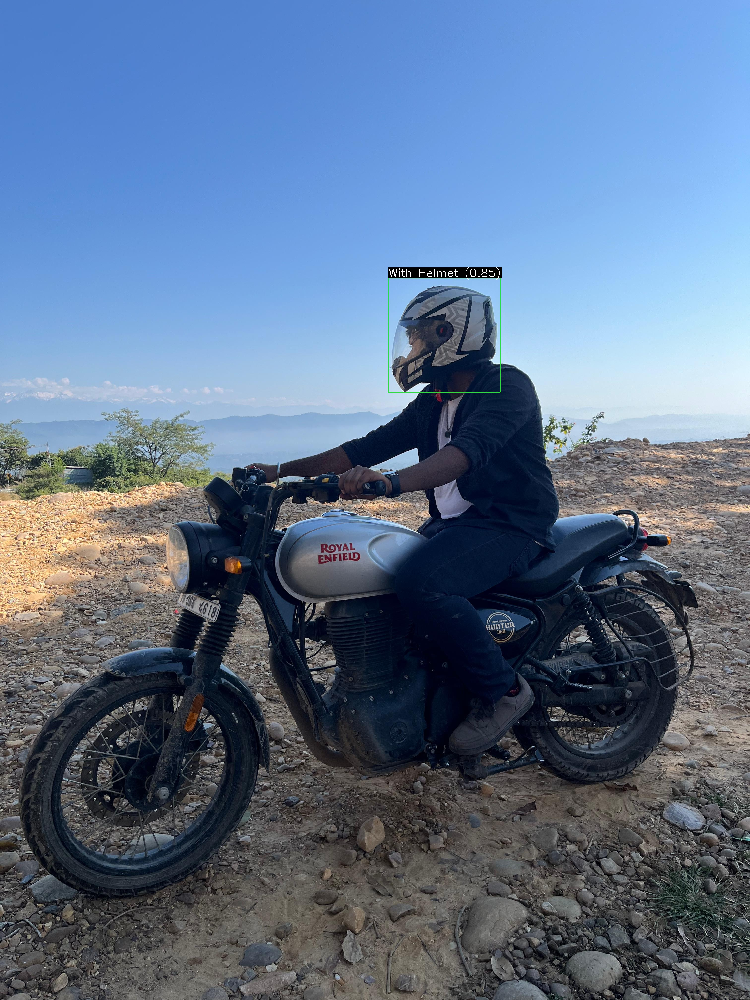
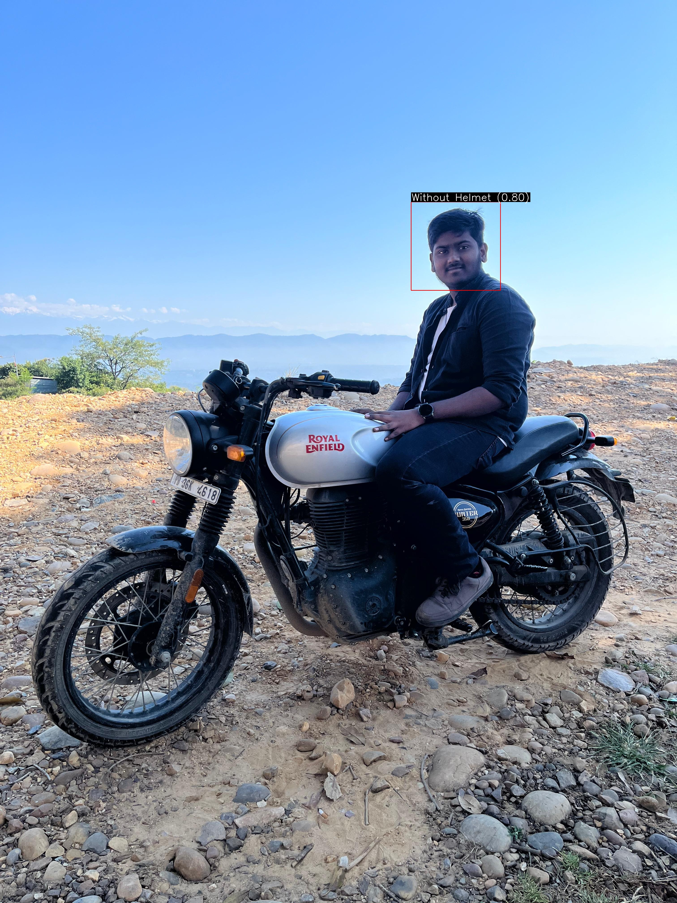

# 🛵 Smart Helmet AI – Smart Visor  
### AI-powered Helmet Detection System using YOLOv8

Smart Helmet AI – Smart Visor is an AI-based system that detects whether a rider is **wearing a helmet or not**.  
The system automatically identifies violations and saves cropped images for further processing or enforcement.

This project uses a **custom-trained YOLOv8 model** for highly accurate helmet detection.

---


🛠️ How to Run Locally
1️⃣ Install dependencies
pip install ultralytics opencv-python numpy

2️⃣ Run detection
python src/detect_image.py

3️⃣ Outputs:

✔ Annotated images saved in outputs/
✔ Cropped violation images saved in violations/

🖼️ Demo Images (Add your images)



----------------------------------------------------------------------

overiew

## 📌 **Problem Statement**

While riding, I observed a common scenario:

- Riders without helmets quickly **escape police checkpoints**
- Some take sudden U-turns to avoid police
- Manual enforcement is slow and inefficient
- Police cannot monitor all roads simultaneously

This inspired the idea:

👉 **Create an automated system that detects helmet violations using AI.**

---

## 🎯 **Project Motivation**

The goal is to build a real-time detection system that:

✔ Identifies riders **With Helmet** and **Without Helmet**  
✔ Crops and saves violation images  
✔ Generates annotated output for visual proof  
✔ Can run on CCTV, mobile cameras, or helmet-mounted cameras  
✔ Can assist traffic police in smarter enforcement  

---

## 🧠 **Solution Overview**

The **Smart Helmet AI** system uses:

- **YOLOv8 Object Detection**
- **Custom-labeled dataset** created using Roboflow
- **Python + OpenCV** for detection, annotation, and cropping
- **Custom training on Google Colab**

The system can extend to:

- Real-time enforcement cameras  
- Automated challan generation  
- Helmet-mounted inspector devices  
- Traffic surveillance systems  

---

## 🗂️ **Dataset Details**

The dataset was created manually and annotated using **Roboflow**.

### **Classes**
- `With Helmet`
- `Without Helmet`

### **Dataset Split**
- **Train:** 82% (95 images)  
- **Validation:** 12% (14 images)  
- **Test:** 6% (7 images)

### **Preprocessing**
- Auto Orient: ON  
- Resize: 512 × 512  
- No augmentation applied  

### **Dataset Path in Colab**

---

## 🏋️ **YOLOv8 Model Training**

Training done on Google Colab with YOLOv8n (fast lightweight model).

### **Training Script**
```python
from ultralytics import YOLO

model = YOLO("yolov8n.pt")
data_yaml_path = "/content/Helmet-Detection_YOLOv8-1/data.yaml"

results = model.train(
    data=data_yaml_path,
    epochs=25,
    imgsz=640,
)

Folder struct
smart-helmet-ai-smart-visor/
│
├── images/                     # Demo images & outputs
├── src/
│   ├── detect_image.py         # Image detection script
│   └── detect_video.py         # Video detection script (optional)
│
├── models/
│   └── best.pt                 # Custom YOLO model (not uploaded)
│
├── outputs/                    # Annotated results
├── violations/                 # Cropped no-helmet detections
├── requirements.txt
├── .gitignore
└── README.md
